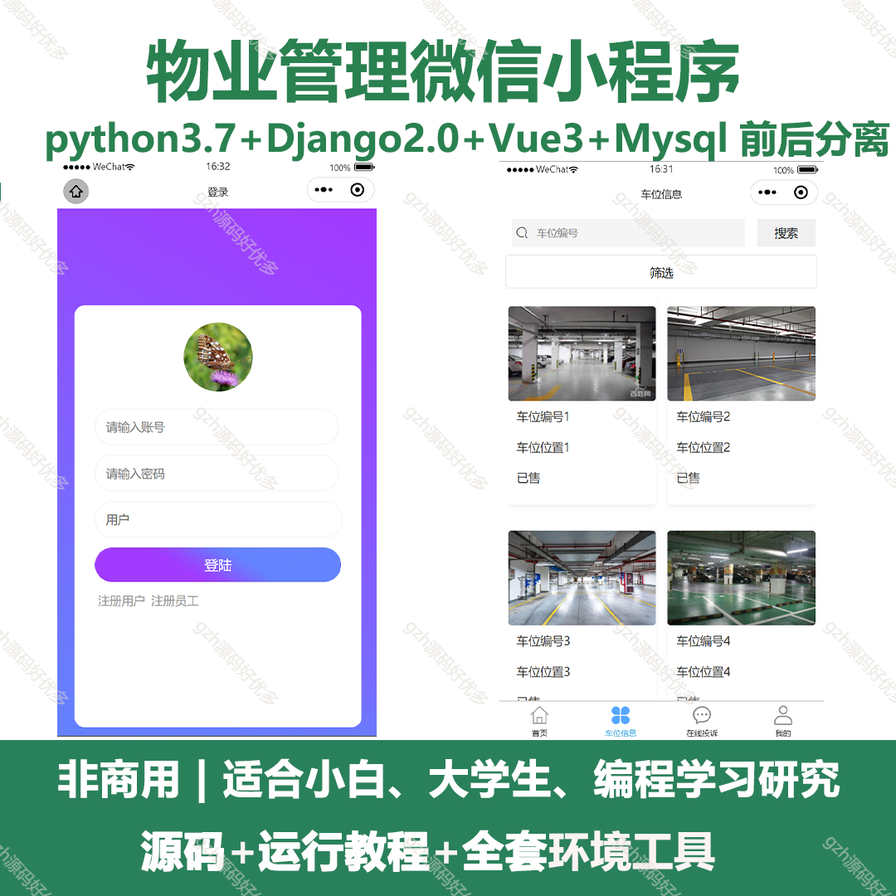
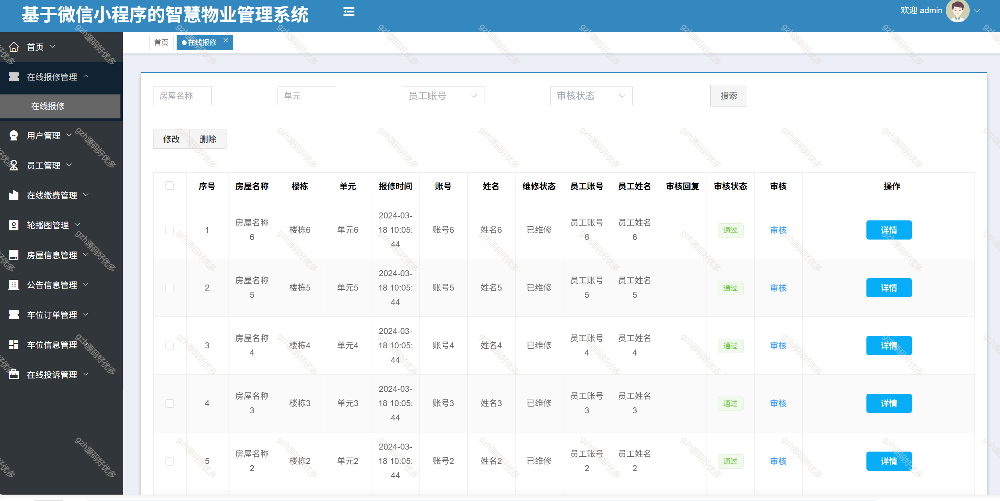
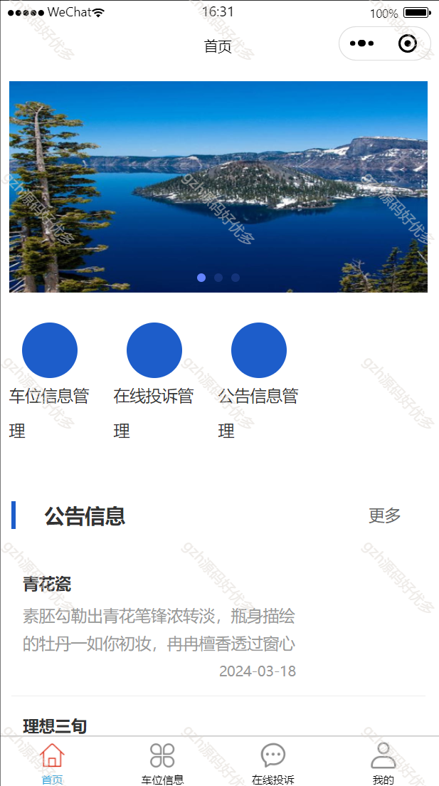
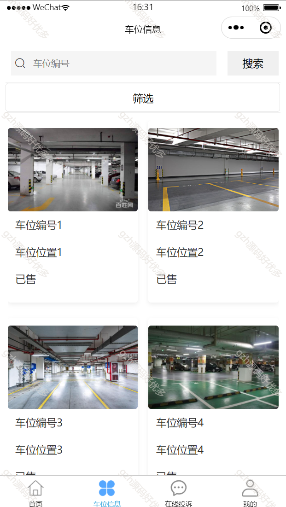
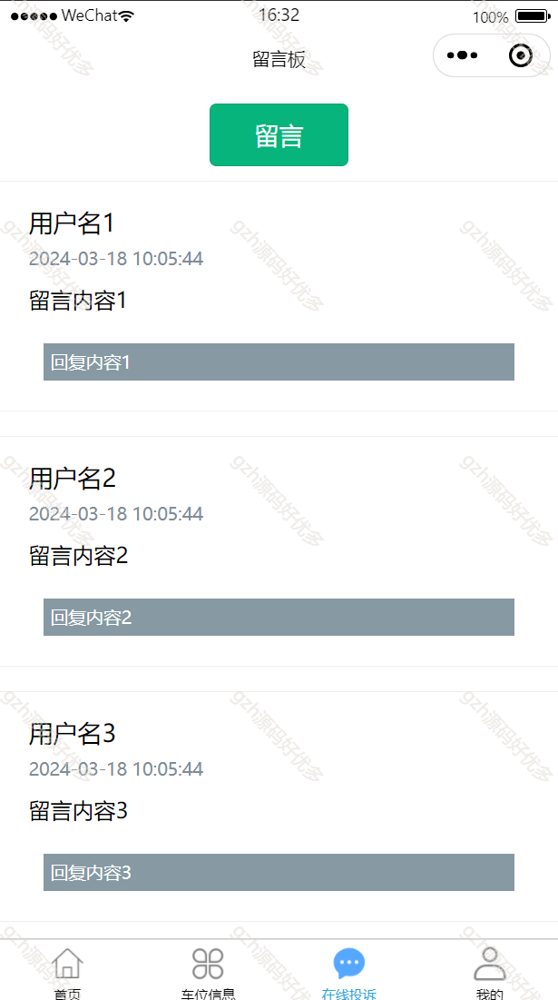
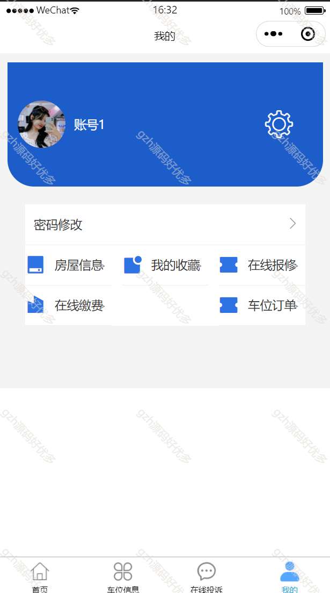
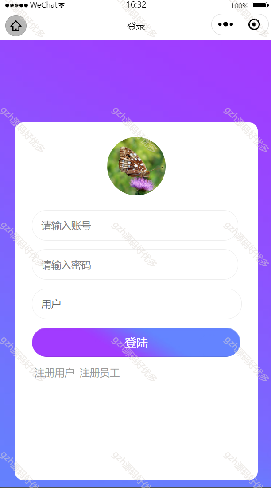
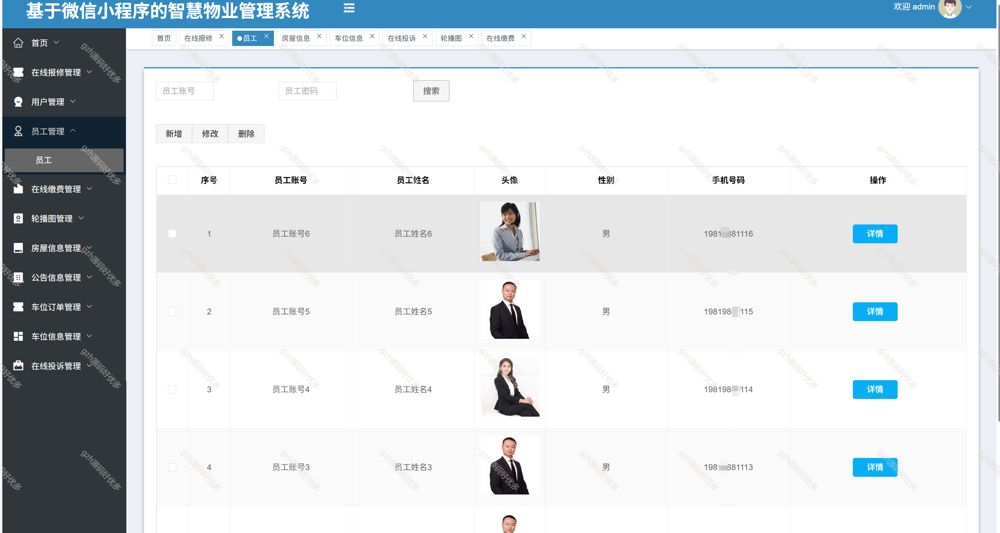
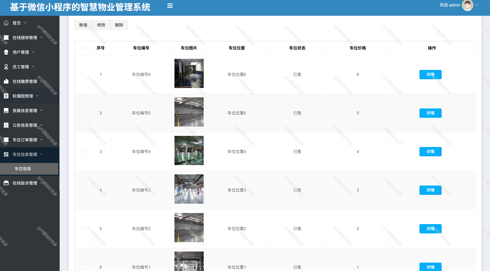

# mpweixinA082
mpweixinA082物业管理微信小程序
 
## 查看主页获取源码

### 一、关键词
物业管理小程序，物业小程序

### 二、作品包含
源码+数据库+全套环境和工具资源+部署教程

### 三、项目技术
前端技术： vue3 Element-plus   Axios 
后端技术：python3.7.7,django2.0

### 四、运行环境（以下版本亲测，其他版本未知，请自测）
开发工具：PyCharm  + VSCODE + 微信开发者工具+HBuilder X

数据库：MySQL5.7

数据库管理工具：Navicat10以上版本

环境配置软件： python3.7.7 , django2.0

前端Nodejs：16

浏览器：谷歌浏览器

### 五、项目介绍
项目编号：mpweixinA082

物业小程序是一种基于微信等小程序平台，为物业公司、业主等提供便捷服务与管理功能的应用程序。它利用移动互联网技术，整合了物业相关的各类服务和信息，旨在提升物业管理效率，优化业主居住体验，促进物业与业主之间的沟通和互动 。
主要功能：
  物业缴费，报修投诉，公告通知，用户管理，员工管理，房屋信息，车位订单，车位信息。

### 六、运行截图

